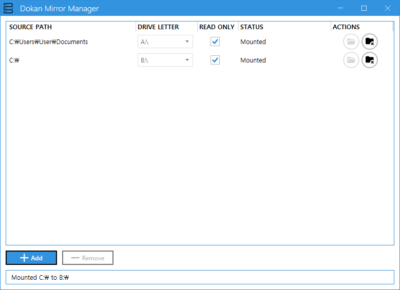

<div align="center">

# ☁️ Dokan Mirror Manager


**A modern WPF application for managing Dokan file system mirrors with an intuitive user interface** 🚀

[Features](#-features) • [Installation](#-installation) • [Usage](#-usage) • [Building](#building-from-source)

</div>

---

## ✨ Features

- 🗂️ **Multiple Mount Management** - Create and manage multiple mirror mounts simultaneously
- 💾 **Drive Letter Selection** - Choose available drive letters from a dropdown menu
- 🔒 **Read-Only Mode** - Mount mirrors in read-only mode for data protection (enabled by default)
- 🎯 **System Tray Support** - Minimize to system tray with notification support
- ⚡ **Single Instance** - Only one application instance runs at a time; launching again restores the window
- 🔄 **Auto-Unmount** - Automatically unmount drives on application exit with confirmation
- 💾 **Persistent Configuration** - Save and restore mount configurations between sessions
- 🏷️ **Dynamic Volume Labels** - Automatically sets volume labels based on source (drive label or folder name)
- 🎨 **Modern UI** - Built with MahApps.Metro for a clean, modern interface
- 🚀 **Non-Blocking Operations** - Async unmount operations keep UI responsive

## 📸 Screenshots



## 📋 Requirements

- 🪟 **Windows 10/11** (x64)
- 🔷 **.NET 8.0 Runtime** - [Download](https://dotnet.microsoft.com/download/dotnet/8.0)
- 📦 **[Dokan Driver](https://github.com/dokan-dev/dokany/releases)** - User mode file system library for Windows
- 🔑 **Administrator privileges** - Required for mount operations

## 📥 Installation

1. **Download** the latest release from the [Releases](../../releases) page
2. **Install** [Dokan Driver](https://github.com/dokan-dev/dokany/releases) if not already installed
3. **Extract** the downloaded archive
4. **Run** `dokan-mirror-manager.exe` as Administrator

> ⚠️ **Important**: The application must be run with Administrator privileges to perform mount operations.

## 📖 Usage

### ➕ Adding a Mount

1. Click the **Add** button
2. Select a source directory or drive using the folder browser
3. Choose an available drive letter from the dropdown
4. **Read Only** mode is enabled by default for safety
5. Click the **Mount** 📂 button to mount the drive

### 🔄 Mounting/Unmounting

- **Mount**: Click the folder open icon (📂) next to the mount item
- **Unmount**: Click the folder remove icon (🗑️) next to the mounted item

### ❌ Removing a Mount

1. Select an **unmounted** item from the list
2. Click the **Remove** button

> 💡 **Tip**: You cannot remove a mounted drive. Unmount it first.

### 🎯 System Tray

- **Minimize**: Close the window to minimize to system tray (shows notification)
- **Restore**: Click the tray icon or launch the application again
- **Exit**: Right-click tray icon → Exit (prompts to unmount drives)

### 🔐 Single Instance

The application runs as a single instance. If you try to launch it while already running:
- If **visible**: Nothing happens (already running)
- If **in tray**: Window automatically restores and comes to front

## 🛠️ Building from Source

### Prerequisites

- 🔧 **Visual Studio 2022** or later (or VS Code with C# extension)
- 🔷 **.NET 8.0 SDK** - [Download](https://dotnet.microsoft.com/download/dotnet/8.0)
- 📦 **Dokan Driver** (for testing) - [Download](https://github.com/dokan-dev/dokany/releases)

### Build Steps

```bash
# Clone the repository
git clone https://github.com/player-alex/dokan-mirror-manager.git
cd dokan-mirror-manager

# Restore dependencies
dotnet restore

# Build the project (Release configuration)
dotnet build -c Release

# Or build for x64 specifically
dotnet build -c Release --arch x64
```

### Run from Source

```bash
# Run as Administrator (required for Dokan operations)
dotnet run --project dokan-mirror-manager/dokan-mirror-manager.csproj
```

> ⚠️ **Note**: Must be run as Administrator for Dokan operations.

### 📦 Building as Library

The project includes `Loader.cs.example` which demonstrates how to use DokanMirror as a library:

1. Change `OutputType` in `.csproj` from `WinExe` to `Library`
2. Rename `Loader.cs.example` to `Loader.cs`
3. Build the project - it will produce `DokanMirror.dll`
4. Call `__Launch__` from your native code to start the application

See [Loader.cs.example](dokan-mirror-manager/Loader.cs.example) for C/C++ usage examples.

## ⚙️ Configuration

Mount configurations are automatically saved to `mounts.json` in the application directory.

**Configuration includes:**
- 📁 Source paths
- 💾 Destination drive letters
- 🔒 Read-only settings

The configuration file is created automatically on first mount and updated whenever changes are made.

## 🔧 Technologies Used

| Technology | Purpose | Version |
|------------|---------|---------|
| [.NET](https://dotnet.microsoft.com/) | Application framework | 8.0 |
| [WPF](https://docs.microsoft.com/en-us/dotnet/desktop/wpf/) | UI framework | - |
| [Caliburn.Micro](https://caliburnmicro.com/) | MVVM framework | 5.0.258 |
| [MahApps.Metro](https://mahapps.com/) | Modern UI toolkit | 2.4.11 |
| [DokanNet](https://github.com/dokan-dev/dokan-dotnet) | .NET wrapper for Dokan | 2.3.0.1 |
| [Hardcodet.NotifyIcon.Wpf](https://github.com/hardcodet/wpf-notifyicon) | System tray support | 2.0.1 |

## 🐛 Troubleshooting

<details>
<summary><b>❌ Application crashes on mount</b></summary>

- ✅ Ensure Dokan Driver is properly installed
- ✅ Run the application as Administrator
- ✅ Check `mount_error.log` in the application directory for details
- ✅ Verify the source path exists and is accessible

</details>

<details>
<summary><b>💾 Drive letter not available</b></summary>

- ✅ Make sure the drive letter is not already in use
- ✅ Check Windows Disk Management for assigned letters
- ✅ Try a different drive letter

</details>

<details>
<summary><b>🚫 Application won't start</b></summary>

- ✅ Verify .NET 8.0 Runtime is installed
- ✅ Check `crash.log` in the application directory
- ✅ Ensure you're running as Administrator
- ✅ Try running from command line to see error messages

</details>

<details>
<summary><b>⚠️ Already running message appears</b></summary>

This is normal behavior. The application uses single-instance mode:
- If the window is hidden in tray, it will be restored automatically
- If the window is already visible, the existing instance continues running

</details>

## 📄 License

This project is licensed under the MIT License - see the [LICENSE](LICENSE) file for details.

## 🙏 Acknowledgments

- [Dokan Project](https://github.com/dokan-dev/dokany) - User mode file system library for Windows
- <a href="https://www.flaticon.com/free-icons/web-server" title="web server icons">Application icon created by Muhamad Ulum - Flaticon</a>

---